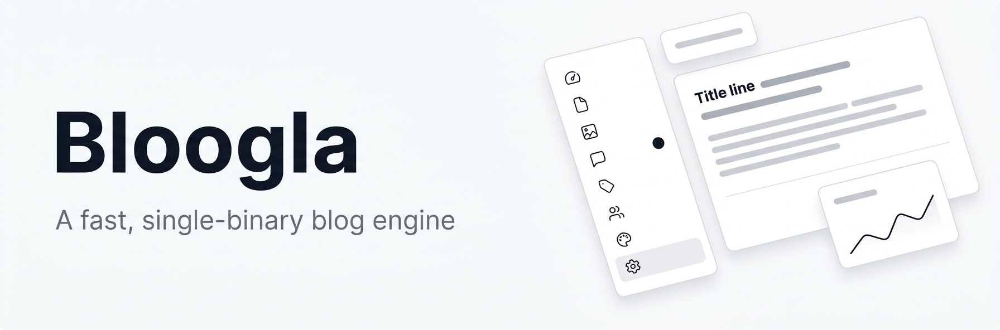
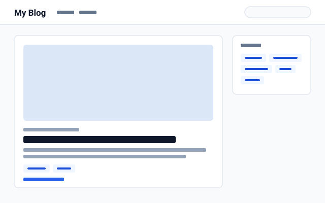
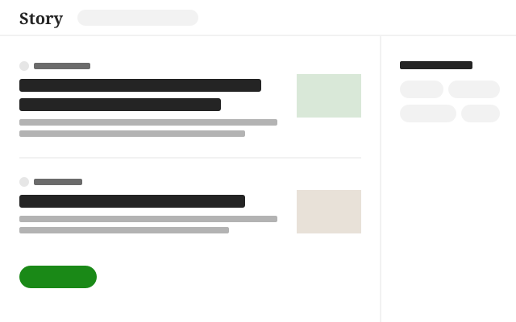
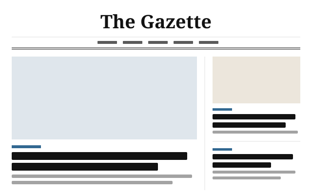

<p align="center">
  
</p>

<p align="center">
  <a href="https://github.com/dincertekin/bloogla/stargazers"></a>
  <a href="https://github.com/dincertekin/bloogla/releases/latest"></a>
  <a href="https://github.com/dincertekin/bloogla/actions/workflows/ci.yml"></a>
  <a href="LICENSE"></a>
  
</p>

<p align="center">
  <b>Everything a blog needs, in one small program.</b><br>
  Copy it to a server, open the link it prints, and start writing.
</p>

<p align="center">
  <a href="#quick-start">Quick start</a> ·
  <a href="#features">Features</a> ·
  <a href="#themes">Themes</a> ·
  <a href="docs/running.md">Docs</a> ·
  <a href="docs/translating.md">Translate</a> ·
  <a href="CONTRIBUTING.md">Contributing</a>
</p>

---

Bloogla is a modern alternative to WordPress for people who just want a fast,
good-looking website. There's no PHP, no database server and no plugins to
keep updated: one file runs the site, the admin panel and the HTTPS
certificate.

- **Simple** — set up in the browser, write in a visual editor, done.
- **Fast** — pages are tiny and served in milliseconds, even on the smallest server.
- **Safe** — strict security by default, two-factor login, signed updates.
- **Yours** — your data in one folder, one-click backups, no tracking.

## Quick start

**On your computer**, to try it or write locally: download Bloogla from the
[latest release](https://github.com/dincertekin/bloogla/releases/latest) and
open it. It opens the setup page in your browser.

| Your computer | Download |
| --- | --- |
| Windows | `bloogla-x86_64-windows.exe` |
| Mac with Apple Silicon (M1 and newer) | `bloogla-aarch64-macos.zip` |
| Mac with Intel | `bloogla-x86_64-macos.zip` |

The first time, Windows and macOS ask whether to trust it;
[here's what to click](docs/running.md#on-your-computer).

**On a server with Docker** (point your domain at the server first):

```bash
docker run -d --name bloogla --restart unless-stopped -p 80:80 -p 443:443 \
  -v bloogla:/app -e BLOOGLA_TLS_DOMAINS=example.com ghcr.io/dincertekin/bloogla
docker logs bloogla   # open the setup link it prints
```

**On a server without Docker:** download the program for your server from the
[latest release](https://github.com/dincertekin/bloogla/releases/latest) and run it:

```bash
chmod +x bloogla-x86_64-linux
BLOOGLA_TLS_DOMAINS=example.com ./bloogla-x86_64-linux
```

With `BLOOGLA_TLS_DOMAINS`, HTTPS certificates come from Let's Encrypt
automatically. More in [Running Bloogla](docs/running.md).

## Features

|                     |                                                                                              |
| ------------------- | -------------------------------------------------------------------------------------------- |
| **Writing**         | Visual editor, drafts and scheduling, pages, tags, image library, revisions, YouTube and Vimeo embeds |
| **Your site**       | Three themes with dark mode, menus, search, comments with spam protection, RSS, sitemap      |
| **Found on Google** | Meta tags, Open Graph, structured data, clean addresses with automatic redirects             |
| **Analytics**       | Views and referring sites per day, without cookies or personal data                          |
| **People**          | Admins, editors and authors, two-factor login, password reset by email                       |
| **Languages**       | English and Türkçe, for the admin panel, the theme and emails                                |
| **Peace of mind**   | Built-in HTTPS, daily backups, one-click `.zip` backup, signed updates you can install from Settings |

## Themes

<table>
  <tr>
    <td align="center" width="33%"><br><b>Default</b><br>A clean, classic blog</td>
    <td align="center" width="33%"><br><b>Story</b><br>Calm reading, Medium-style</td>
    <td align="center" width="33%"><br><b>Gazette</b><br>A newspaper front page</td>
  </tr>
</table>

Pick one in **Appearance** and change its colors and texts without touching
code. Want your own? Themes are plain HTML and CSS: see
[Writing themes](docs/themes.md).

## Updating

Open **Settings → Updates** and click **Check for updates**. On Linux and
Macs, **Install** downloads the new version, checks it's a genuine signed
Bloogla release, and restarts in a few seconds. You can also let Bloogla
check every day and install new versions by itself.

On Windows, download the new `.exe` and use it in place of the old one. With
Docker, run `docker pull ghcr.io/dincertekin/bloogla`, then start the
container again with the same command; your site lives in the `bloogla`
volume. Download a backup first either way (**Settings → Backup**).
[All the details](docs/running.md#updating).

## Documentation

- [Running Bloogla](docs/running.md): servers, configuration, commands, updates, backups
- [Writing themes](docs/themes.md): templates, options, the security policy
- [Translating](docs/translating.md): adding your language, no programming needed
- [Security](docs/security.md): how a Bloogla site is protected
- [Contributing](CONTRIBUTING.md): development setup, code tour, house rules

## Help translate Bloogla

Bloogla speaks English and Türkçe. Want it in your language? A language is
one file of short texts, and you can add it right in your browser, no
programming needed. The [translation guide](docs/translating.md) shows how,
or [say hello](https://github.com/dincertekin/bloogla/issues/new?template=translation.yml)
if you'd like to help review one.

## Contributing

Bug reports, translations, themes and code are all welcome. Start with
[CONTRIBUTING.md](CONTRIBUTING.md); it takes one command (`cargo run`) to
have a local site running. Found a security issue? Please report it
[privately](SECURITY.md).

Built with [Rust](https://www.rust-lang.org), [axum](https://github.com/tokio-rs/axum),
[SQLite](https://sqlite.org) and [htmx](https://htmx.org).

## Star history

<a href="https://star-history.com/#dincertekin/bloogla&Date">
  <picture>
    <source media="(prefers-color-scheme: dark)" srcset="https://api.star-history.com/svg?repos=dincertekin/bloogla&type=Date&theme=dark">
    
  </picture>
</a>

## License

[MIT](LICENSE) © Dinçer Tekin
